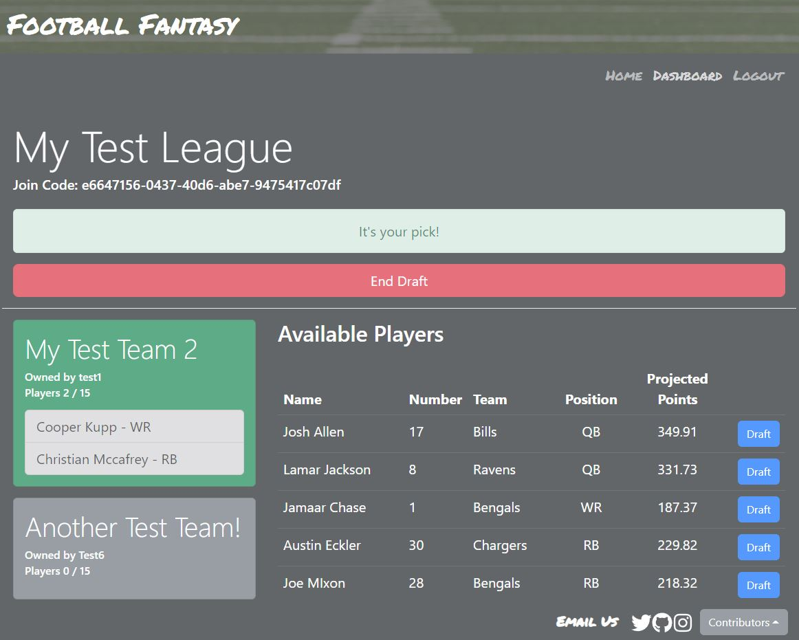

# Welcome to Football Fantasy

Football Fantasy is a web application that allows you to create your own fantasy football league with friends. Pick your favorite players, draft them to your team and defeat your friends on a weekly bases.

Try it [here](https://fantasy-football-draft-app.herokuapp.com/)

## 🧐 Table of Contents

- Demo

- The Requirements

- User Story

- Installation Steps

- Authors

- Credits

- Technologies Used

## 🚀 Demo

[Deployed App](https://fantasy-football-draft-app.herokuapp.com/)

## The Requirements
- Use React for the front end.
- Use GraphQL with a Node.js and Express.js server.
- Use MongoDB and the Mongoose ODM for the database.
- Use queries and mutations for retrieving, adding, updating, and deleting data.
- Be deployed using Heroku (with data).
- Have both GET and Post routes for retrieving and adding new data.
- Have a polished UI.
- Be responsive.
- Be interactive (i.e., accept and respond to user input).
- Include authentication (JWT).
- Protect sensitive API key information on the server.
- Have a clean repository that meets quality coding standards (file structure, naming conventions, best practices for class and id naming conventions, indentation, quality comments, etc.).
- Have a high-quality README (with unique name, description, technologies used, screenshot, and link to deployed application).

## User Story
User Story:
AS A football fanatic I WANT to play a game amongst friends, associates, or even meet new friends while competing with their knowledge of the game SO THAT I enjoy NFL sunday’s even when my team sucks.

GIVEN a team with 15 spots, I will draft players by using the search input in my dashboard. WHEN I am presented with various players of different positions, I can choose and  add them to my team. 

## 🛠️ Installation Steps
The project was uploaded to GitHub at the following [repository] (https://github.com/MosNes/fantasy-football-draft.git)

To install the project follow these steps:

1. Clone the application from GitHub with (git clone https://github.com/MosNes/fantasy-football-draft.git) From the root folder.
1. npm install
1. Run the app with node server.js

## 🌟 Authors
- Cody Cooper
- Dejuan Strong
- Mackenzie Abe
- McKinley Faustin
- Moses Nester

## 💻 Credits
- Moses Nester
  - Front-end scripting & Back-end scripting
- Mackenzie Abe
  - Front-end scripting & Presentation 
- Dejuan Strong
  - Assets builder & Presentation
- Cody Cooper
  - Front-end scripting & requirement keeper
- McKinley Faustin
  - Front-end scripting, README, and Presentation 

## 🍰 Technologies Used
- REACT
- JavaScript
- MongoDB
- Node.js
- GraphQL
- JWT authentication
- Heroku
- Github
